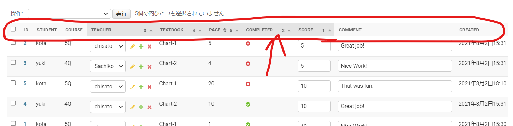
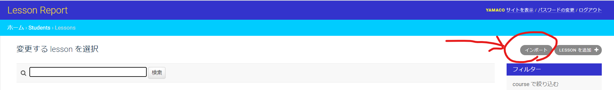

# ManyToMany MECE Lesson Report


## Objectives:
1. Offer **MECE** lessons to students of **various levels/ages** who take classes at random dates.
2. Simplify lesson plan, reporting tasks, track student progress and create personal-word-learning-app with **Django and javascript**

* MECE = Mutually Exclusive, Collectively Exhaustive

***

## Prerequisites:
1. A wide range of students from 3 years old to adults
2. Multiple online teachers
3. More than 120 students
4. Random enrollment time and lesson reservation
5. 10 courses in total (Each course has a several textbooks)
6. Students have troubles with memorizing new words

***
# 🚩 Distinctiveness and Complexity
1. With this app, the teachers record the designated textbook titles (4 types for each level), pages,  and scores for each lesson, and this data is shared among other instructors. On the student side, they can view their own lesson report with graphs and summarized data.
All of this data is saved into **Django's SQLite3 database** and can be quickly and easily accessed and manipulated.

2. Most notable is the **Django Built-in Admin Features**, which are *fully customized* to meet the above prerequisites --- **search, sort, and edit functions on the Admin Lesson Page (list screen)** --- which enables teachers to easily decide which textbook/page they should do in each lesson as well as to evaluate the student, and make comments.
In addition to the **Permission Functions** that can be easily customized, the **login URL of the Teacher Admin Page** is customized.

3. Leesson reports above are instantly reflected on the student side as soon as the teachers fill in the data. The **Ajax frontend with Charts.js** allows a seamless **Single Page Application** with customizable aesthetics and *quick DOM updates*. **Bootstrap CSS library** is also integrated to assist with styling.

4. **The Django-import-export plugin for “CSV-Import-Function”** implemented for batch registration of initial data makes it very easy and quick to migrate the system from the old system to this application.

5. On the student side, the **“Private-Vocabulary-Function (My Words page)”** is implemented, where each student can **CRUD (create, edit, and delete)** the "WordsTo Remember List,” which aslo uses **Ajax frontend**.

6. Student page shows adjectives ( in English and Japansese ) generated by **Python Random Choice** on every visit.
***

# 🚩Files and Contents:

capstone  
├── .gitignore* -- Telling Git which folder/file to ignore   
├── README.md*  -- This file  
├── capstone/   -- Main project folder   
│   ├── asgi.py*  -- ASGI config for capstone project  
│   ├── settings.py*  -- Modified: BASE_DIR, INSTALLED_APPS, TEMPLATES, DATABASES, LANGUAGE_CODE, TIME_ZONE, STATICFILES_DIRS, and LOGIN_URL  
│   ├── urls.py*  -- Project path configuration   
├── img/  -- Screenshots of each page/function  
├── manage.py*  
├── requirements.txt*  -- List of libraries needed to run  
├── static/  -- Admin CSS settings  
│   └── base_site.css*  -- Customized Admin CSS  
├── students/  Django students App  
│   ├── admin.py*  -- Fully customized for teacher input    
│   ├── apps.py*  -- students app config  
│   ├── forms.py*  -- Form for students to add words to remember  
│   ├── migrations/  -- Automatically Created and manage database definitions by making migration  
│   ├── models.py*  -- Database models  
│   ├── static/  -- Images, favicon, and CSS  
│   │   ├── images/  -- Static images  
│   │   └── students/  -- favicon and CSS  
│   │       ├── favicon.ico*   
│   │       └── styles.css*  
│   ├── templates/  -- HTML file folder for students app  
│   │   └── students/  -- Name space for url.py to find each file  
│   │       ├── ajax.html*  -- "My Words" page for students  
│   │       ├── base.html*  -- Settings common to all templates  
│   │       ├── index.html*  -- Filtered lesson data  
│   │       ├── login.html*  -- Student login page  
│   │       ├── mychart.html*  -- Filtered lesson data with a chart  
│   │       ├── myword.html*  -- Students' personal word list  
│   │       └── register.html*  -- Student register page   
│   ├── urls.py*  -- Student app path configration  
│   └── views.py*  -- All functions are hundled here  
├── templates/  -- Admin HTML customization  
│   └── admin/  
│       └── base_site.html*   


***

# 🚩 Three types of Access and Permission
  
### ⭐ 1. students: (url: index, mychart)
- View their own lesson achievements
    1) List of textbook/pages and completed pages, scores, dates, and comments from teachers
    2) Lesson progress charts
    3) Random greeting message (just for fun!)
### ⭐ 2. teachers: (url: mypage)
- Keep record of lessons
    1) Unable to delete any data
    2) view and edit lesson records on the list-display
    3) Able to search/sort data by names, courses, dates
    4) Avoiding the 'n+1' issue (regarding ForeignKeyField)
### ⭐ 3. manager: (url: teacher-admin)
- Advanced staff authority settings
    1) permission to add and edit courses, textbooks, lessons, and manage users.
    2) upload csv data from admin page (using django-import-export)
***


# 🚩 Installation

1. git clone
2. pip3 install -r requirements.txt
3. python3 manage.py makemigrations
4. python3 manage.py migrate
5. python3 manage.py createsuperuser
6. python3 manage.py runserver
7. 'teacher-admin' for admin.site
8. Add users for
    1. student
        - url: http://127.0.0.1:8000/
    2. teacher: edit permission in accordance with your preferences
        - url: http://127.0.0.1:8000/mypage/
    3. manager: 'is_staff', and edit permissions
        - url: http://127.0.0.1:8000/teacher-admin/
9. Add some Words (as Manager) by either CSV or 1 by 1
10. Add some Courses (as Magager) 1 by 1
11. Add some Lessons (as Teacher or Manager) by either CSV or 1 by 1

***

# 🚩Modules and Customization

## ⭐1. django-admin-sortable:


```python:shell
$ pip3 install django-admin-sortable
```

✨Add 'adminsortable' to Settings.py

```python:settings.py
INSTALLED_APPS = [
    'django.contrib.admin',
    'django.contrib.auth',
    'django.contrib.contenttypes',
    'django.contrib.sessions',
    'django.contrib.messages',
    'django.contrib.staticfiles',
    'app',
    'adminsortable', # Add this
]
```

✨Edit 'admin.py' in accordance with your models.py:

```python:admin.py
from django.contrib import admin
from .models import Tutorial
from adminsortable.admin import SortableAdmin

# Inherit SortableAdmin
class YourModelAdmin(SortableAdmin):
    list_display = ('id', 'title') #As many list as your keys
    list_display_links = ('id', 'title') #As many list as your keys
admin.site.register(YourModel, YourModelAdmin)
```




## ⭐2. django-import-export


```python:install

$ pip3 install django-import-export
```

> Add 'import-export' to setting.py

```python:settings.py

INSTALLED_APPS = (
    ...
    'import_export',
)
```

> Write models.py of which you want to import-CSV

```python:models.py
class YourModel(models.Model):
    model1 = models.CharField('Model1 name', max_length=100)
    model2 = models.CharField('Model2 name', max_length=100)
```

> Link 'YourModelResource' and 'YourModel' in admin.py

```python:admin.py
from django.contrib import admin
from import_export import resources
from import_export.admin import ImportExportModelAdmin

from .models import YourModel

class YourModelResource(resources.ModelResource):
    # django-import-export settings
    class Meta:
        model = YourModel


@admin.register(YourModel)
class YourModelAdmin(ImportExportModelAdmin):
    # Instantiate ImportExportModelAdmin
    ordering = ['id']
    list_display = ('id', 'model1', 'model2')

    # Settings for django-import-exports
    resource_class = YourModelResource
```

> 📌Don't forget to register YourModel and YourModelAdmin to 'admin.site'

```python:admin.py
admin.site.register(YourModel, YourModelAdmin)
```




📌In my case: I just added import function


## ⭐3.chart.js

You can easily add charts by following tutorials on Official-Site:
[Chart.js](https://www.chartjs.org/docs/latest/)

Tutorial videos for Chart.js:  [Django with Chart js | How to create charts with Django and Chart js](https://www.youtube.com/watch?v=1OL5n06kO_w)


# Note

### CSV headings:

1. WORD LIST: UUID, word_eng, word_jap

2. LESSON DATA: UUID, student, course, teacher, textbook, page, score, comment, created, updated, completed

📌 Fail to use exact the same headings will cause errors when importing CSV
***

# 🚩 Author


* Developer: yamaco
* Company: [ask-honko](https://ask946.com/)
* blog1: [LearnJapanese](https://yamaco.work/)
* blog2: [askDjaPy](https://www.askdjapy.com/)
* E-mail: t_yamamoto@ask946.com
* E-mail: askkyodai@gmail.com

# License

"ManyToMany MECE Lesson Report" is under [MIT license](https://en.wikipedia.org/wiki/MIT_License).
